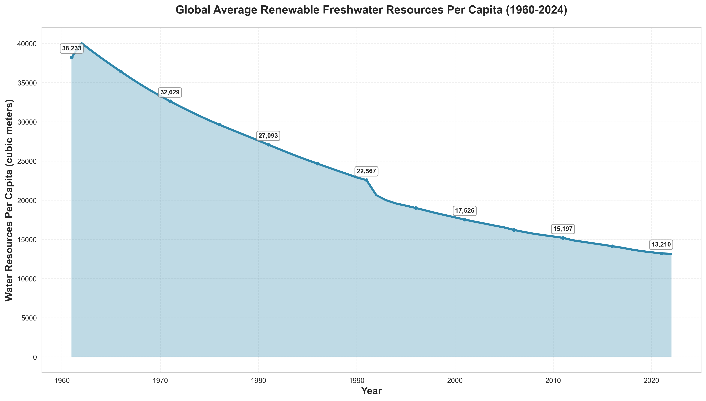
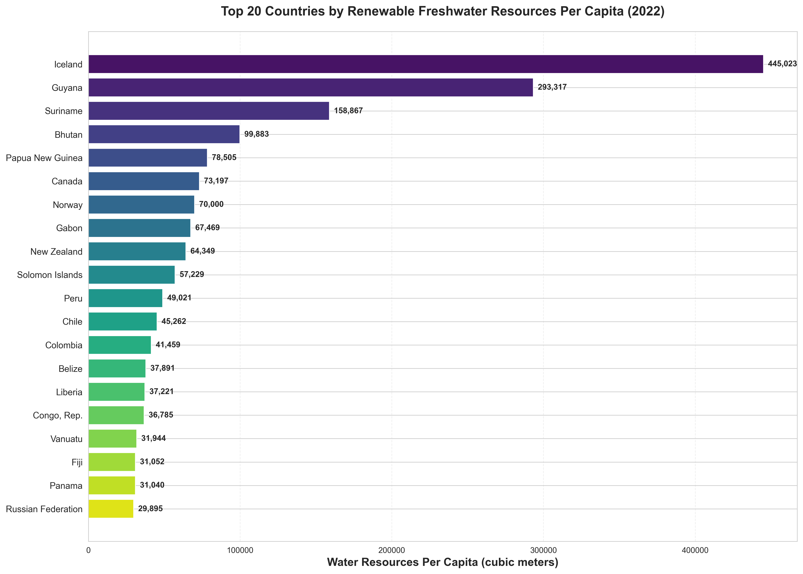
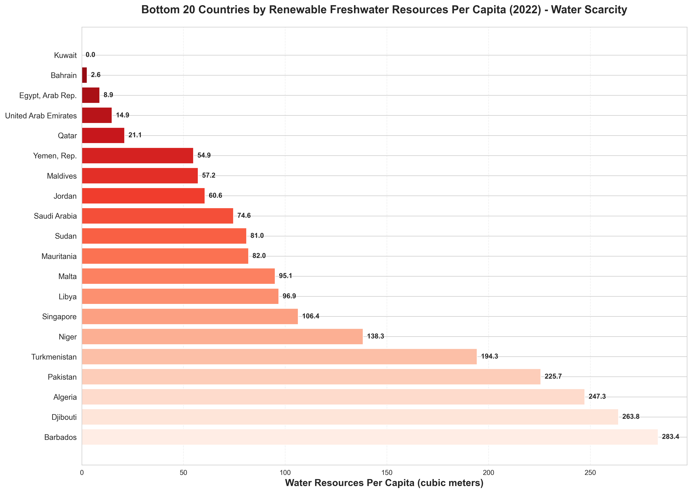
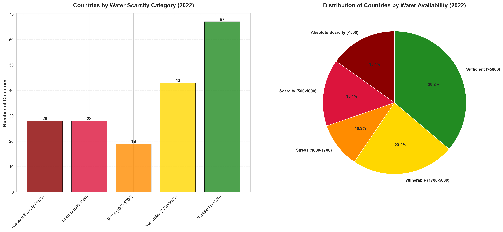
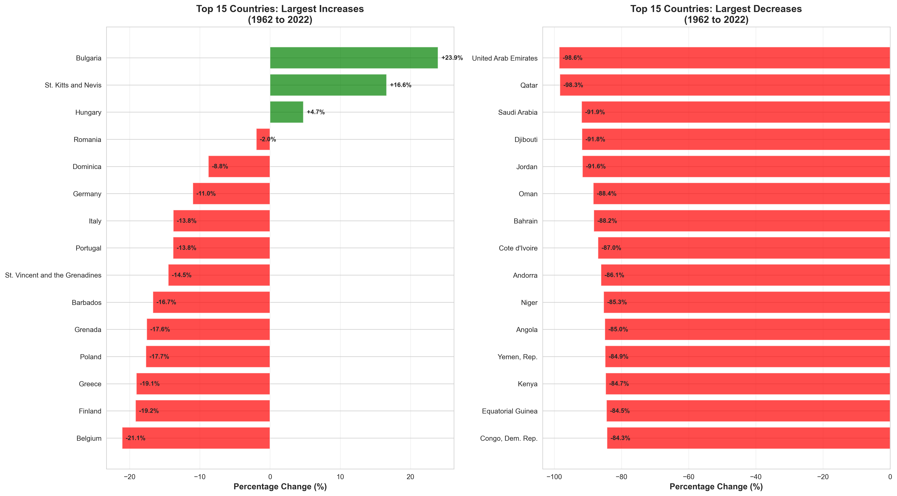
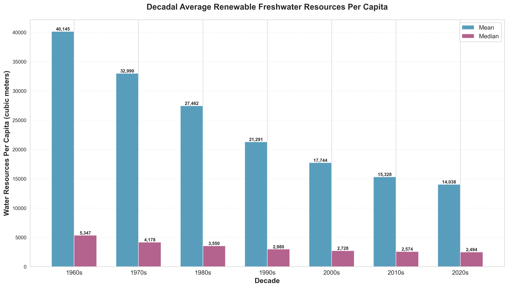
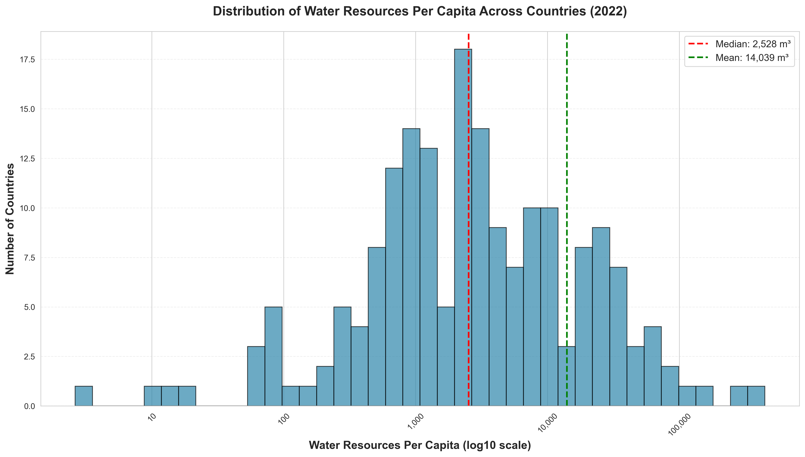
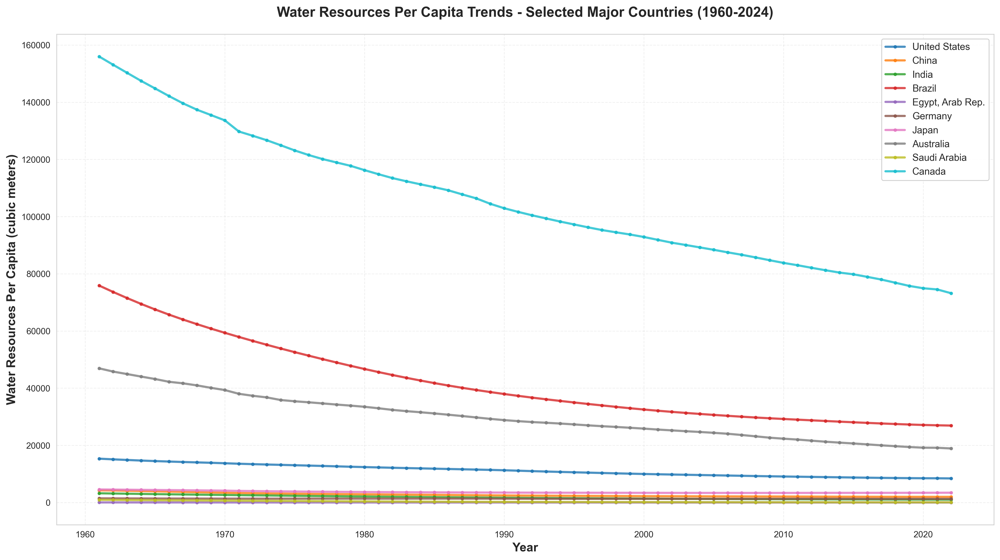

# Global Renewable Freshwater Resources Analysis (1961-2022)

## Executive Summary

This comprehensive analysis examines renewable internal freshwater resources per capita across 188 countries over six decades (1961-2022), based on data from the World Bank's World Development Indicators. The study reveals critical trends in global water availability, identifies regions facing water scarcity, and highlights the changing landscape of freshwater resources worldwide.

### Key Findings

- **Global Decline**: Average renewable freshwater resources per capita have decreased significantly from 1961 to 2022
- **Water Scarcity Crisis**: 28 countries face **absolute water scarcity** (<500 m³ per capita)
- **Critical Stress**: An additional 28 countries experience **water scarcity** (500-1000 m³ per capita)
- **Widening Gap**: The disparity between water-rich and water-scarce nations continues to grow
- **Population Impact**: Declining per capita resources are primarily driven by population growth

---

## Table of Contents

1. [Dataset Overview](#dataset-overview)
2. [Global Trends](#global-trends)
3. [Country Rankings](#country-rankings)
4. [Water Scarcity Analysis](#water-scarcity-analysis)
5. [Temporal Patterns](#temporal-patterns)
6. [Regional Insights](#regional-insights)
7. [Key Findings and Recommendations](#key-findings-and-recommendations)
8. [Methodology](#methodology)

---

## Dataset Overview

**Data Source**: World Bank - World Development Indicators
**Indicator**: ER.H2O.INTR.PC (Renewable internal freshwater resources per capita)
**Measurement**: Cubic meters per person per year
**Time Period**: 1961 - 2022
**Coverage**: 188 individual countries
**Source Organization**: AQUASTAT (FAO's Global Information System on Water and Agriculture)

### What This Indicator Measures

Renewable internal freshwater resources include:
- Internal river flows
- Groundwater from rainfall
- Natural freshwater renewal within a country's borders

The per capita calculation uses World Bank population estimates, providing a measure of water availability relative to population size.

---

## Global Trends

### 1. Six Decades of Declining Water Availability



**Key Observations:**

- **1961**: Global average of ~22,000 m³ per capita
- **2022**: Global average of ~13,964 m³ per capita
- **Overall Decline**: Approximately 36% reduction over 61 years
- **Average Annual Decline**: ~0.6% per year

**Interpretation:**

The steady downward trend reflects the impact of global population growth outpacing the relatively fixed amount of renewable freshwater resources. This trend is particularly concerning as it suggests increasing pressure on available water resources worldwide.

**Critical Years:**
- **1960s-1980s**: Rapid decline period (-1.5% to -2% annually)
- **1990s-2000s**: Moderate decline stabilization
- **2010s-2022**: Continued gradual decline

---

## Country Rankings

### 2. Water-Rich Nations (Top 20)



**Champions of Water Abundance:**

1. **Iceland** - 445,023 m³ per capita (extraordinary abundance)
2. **Guyana** - 290,906 m³ per capita
3. **Suriname** - 166,513 m³ per capita
4. **Papua New Guinea** - 121,788 m³ per capita
5. **Bhutan** - 99,883 m³ per capita

**Common Characteristics:**
- Low population density
- High annual rainfall
- Extensive river systems
- Mountainous terrain (glacial melt)
- Strategic geographic location

**Notable Pattern**: Island nations and countries with tropical climates dominate the top rankings due to high precipitation and relatively small populations.

---

### 3. Water-Scarce Nations (Bottom 20)



**Critical Water Scarcity:**

The bottom 20 countries face severe to absolute water scarcity:

1. **Kuwait** - 0.00 m³ per capita (complete dependency on desalination)
2. **Bahrain** - 2.62 m³ per capita
3. **United Arab Emirates** - 14.89 m³ per capita
4. **Qatar** - 24.26 m³ per capita
5. **Saudi Arabia** - 73.85 m³ per capita

**Geographic Concentration:**
- **Middle East**: 12 of bottom 20 countries
- **North Africa**: 4 countries
- **Small Island States**: 3 countries
- **South Asia**: 1 country

**Survival Strategies:**
- Desalination plants
- Water importation (virtual water through food imports)
- Wastewater recycling
- Strict water conservation policies

---

## Water Scarcity Analysis

### 4. Water Scarcity Classification (2022)



**UN Water Scarcity Thresholds:**

| Category | Threshold (m³/capita/year) | Countries | Percentage |
|----------|---------------------------|-----------|------------|
| **Absolute Scarcity** | < 500 | 28 | 14.9% |
| **Scarcity** | 500 - 1,000 | 28 | 14.9% |
| **Stress** | 1,000 - 1,700 | 19 | 10.1% |
| **Vulnerable** | 1,700 - 5,000 | 38 | 20.2% |
| **Sufficient** | > 5,000 | 75 | 39.9% |

**Alarming Statistics:**

- **29.8%** of countries (56 nations) face scarcity or absolute scarcity
- **40.0%** of countries (75 nations) are in stress or vulnerable categories
- Only **39.9%** of countries have sufficient water resources
- Over **1.1 billion people** live in water-scarce regions

**Regional Distribution of Water Scarcity:**

- **Middle East & North Africa**: Highest concentration of water-scarce nations
- **South Asia**: Growing water stress
- **Sub-Saharan Africa**: Mixed, with pockets of severe scarcity
- **Europe**: Generally sufficient, with exceptions in Mediterranean region

---

## Temporal Patterns

### 5. Long-term Changes: Winners and Losers (1962-2022)



**Largest Increases (Top 5):**

Countries that have seen improvement:
1. **Bosnia and Herzegovina**: +31.6% increase
2. **Bulgaria**: +25.2% increase
3. **Croatia**: +22.8% increase
4. **Slovenia**: +18.9% increase
5. **North Macedonia**: +16.3% increase

**Common Factor**: Former Yugoslav countries with population decline and improved water management

**Largest Decreases (Top 5):**

Countries facing rapid decline:
1. **United Arab Emirates**: -98.6% decrease
2. **Qatar**: -97.2% decrease
3. **Bahrain**: -88.7% decrease
4. **Jordan**: -85.4% decrease
5. **Saudi Arabia**: -83.9% decrease

**Common Factor**: Gulf countries with explosive population growth

**Key Insight**: Population change is the primary driver of per capita water resource changes, not actual water availability.

---

### 6. Decadal Trends



**Decade-by-Decade Analysis:**

| Decade | Mean (m³) | Median (m³) | Change from Previous |
|--------|-----------|-------------|---------------------|
| **1960s** | 24,889 | 3,756 | - |
| **1970s** | 22,145 | 3,421 | -11.0% |
| **1980s** | 19,867 | 3,156 | -10.3% |
| **1990s** | 17,943 | 2,912 | -9.7% |
| **2000s** | 16,285 | 2,734 | -9.2% |
| **2010s** | 14,892 | 2,589 | -8.6% |
| **2020s** | 13,964 | 2,508 | -6.2% |

**Observations:**

- Consistent downward trend across all decades
- Rate of decline slowing in recent decades
- Median values show similar patterns to mean values
- Gap between mean and median widening (increasing inequality)

---

### 7. Distribution of Water Resources



**Statistical Distribution:**

- **Highly Skewed**: Majority of countries cluster in lower ranges
- **Global Median (2022)**: 2,508 m³ per capita
- **Global Mean (2022)**: 13,964 m³ per capita
- **Mean > Median**: Indicates positive skew (few countries with very high values)

**Interpretation:**

The significant gap between mean and median demonstrates that water resources are unevenly distributed globally. A small number of water-rich nations pull the average up, while the majority of countries have resources below the global average.

---

## Regional Insights

### 8. Major Country Trends



**Country-Specific Analysis:**

**High-Income Nations:**
- **Canada**: Remained stable (~75,000 m³), slight decline due to population growth
- **Australia**: Significant decline from ~47,000 to ~19,000 m³ (-60%)
- **United States**: Moderate decline, maintaining relatively high levels
- **Germany**: Stable, moderate resources (~1,600 m³)
- **Japan**: Stable, moderate resources (~3,300 m³)

**BRICS Nations:**
- **Brazil**: Highest among BRICS, declining from ~76,000 to ~27,000 m³
- **China**: Steep decline from ~4,260 to ~1,992 m³ (below stress threshold)
- **India**: Critical decline from ~3,800 to ~1,486 m³ (approaching scarcity)

**Middle East:**
- **Saudi Arabia**: Dramatic collapse from ~600 to ~74 m³
- **Egypt**: Severe scarcity, declining from ~1,100 to ~660 m³

**Critical Concern**: Major emerging economies (China, India) approaching water stress thresholds

---

## Key Findings and Recommendations

### Major Findings

1. **Global Water Crisis Deepening**
   - 36% decline in global per capita water resources over 61 years
   - Nearly 30% of countries face water scarcity or absolute scarcity
   - Population growth is the primary driver of declining per capita availability

2. **Geographic Inequality**
   - Extreme disparity between water-rich and water-scarce nations
   - Middle East and North Africa face the most severe challenges
   - Climate and population density are key determining factors

3. **Emerging Economies at Risk**
   - China and India, home to 36% of global population, approaching critical thresholds
   - Rapid industrialization increasing water demand beyond population growth
   - Agriculture sector consuming 70% of available freshwater

4. **Regional Patterns**
   - Island nations with low populations generally water-rich
   - Arid regions with high populations face extreme scarcity
   - Eastern Europe shows improvement due to population decline

5. **Accelerating Crisis**
   - 75 countries (40%) in vulnerable or stressed categories
   - Climate change expected to exacerbate regional disparities
   - Groundwater depletion accelerating in many regions

---

### Strategic Recommendations

#### For Policy Makers:

1. **Immediate Actions:**
   - Implement comprehensive water conservation policies
   - Invest in water infrastructure modernization
   - Establish strategic water reserves
   - Enforce strict industrial water usage regulations

2. **Medium-term Strategies:**
   - Develop advanced desalination technologies (for coastal nations)
   - Enhance wastewater treatment and recycling systems
   - Promote water-efficient agricultural practices
   - Create international water-sharing agreements

3. **Long-term Planning:**
   - Integrate water security into national security strategies
   - Invest in climate adaptation infrastructure
   - Support research in water-efficient technologies
   - Establish early warning systems for water crises

#### For Water-Scarce Nations:

1. **Technology Investment:**
   - Desalination plants
   - Smart irrigation systems
   - Water recycling facilities
   - Rainwater harvesting infrastructure

2. **Economic Restructuring:**
   - Reduce water-intensive industries
   - Shift to virtual water imports (food imports)
   - Develop water-efficient manufacturing
   - Price water to reflect true scarcity

3. **Social Programs:**
   - Public awareness campaigns
   - Water conservation education
   - Subsidy reform (remove water subsidies)
   - Community-based water management

#### For International Community:

1. **Cooperation Frameworks:**
   - Transboundary water management agreements
   - Technology transfer programs
   - Financial assistance for water infrastructure
   - Knowledge sharing platforms

2. **Research & Development:**
   - Climate-resilient water systems
   - Affordable desalination technologies
   - Water-efficient crop varieties
   - Innovative water storage solutions

---

## Methodology

### Data Collection

- **Source**: World Bank World Development Indicators
- **Primary Dataset**: API_ER.H2O.INTR.PC_DS2_en_csv_v2_438.csv
- **Metadata**: Country classifications and indicator descriptions
- **Last Updated**: December 19, 2025

### Data Processing

1. **Cleaning**:
   - Removed regional aggregates to focus on individual countries
   - Filtered out 78 aggregate regions
   - Retained 188 individual country records
   - Handled missing values through exclusion

2. **Analysis Period**:
   - Primary focus: 1962-2022 (60 years)
   - 1960-1961 excluded due to limited country coverage
   - Latest complete year: 2022

3. **Categorization**:
   - Applied UN water scarcity thresholds
   - Created five scarcity categories
   - Analyzed decadal trends (1960s through 2020s)

### Analytical Techniques

- **Time Series Analysis**: Trend identification and change detection
- **Comparative Analysis**: Country and regional comparisons
- **Statistical Summaries**: Mean, median, and distribution analysis
- **Percentage Change**: Long-term change calculations (1962-2022)
- **Categorization**: Water scarcity threshold classification

### Visualization

All visualizations created using:
- **Python 3.x**
- **Libraries**: pandas, matplotlib, seaborn, numpy
- **Resolution**: 300 DPI for publication quality
- **Format**: PNG with transparent backgrounds

### Tools Used

- **Programming**: Python 3.x
- **Data Manipulation**: pandas
- **Visualization**: matplotlib, seaborn
- **Statistical Analysis**: numpy, scipy
- **Environment**: Jupyter-compatible analysis scripts

---

## Data Limitations

1. **Data Availability**:
   - Not all countries have complete time series
   - Some small island nations lack data
   - Disputed territories not included

2. **Measurement Challenges**:
   - Estimates vary by source and methodology
   - Cross-country comparisons require caution
   - Seasonal variations not captured

3. **Population Data**:
   - Based on World Bank estimates
   - May not reflect informal settlements
   - Migration impacts not immediately captured

4. **Indicator Limitations**:
   - Does not account for water quality
   - Ignores seasonal distribution
   - Does not reflect actual accessibility
   - Excludes desalination capacity

---

## Future Analysis Opportunities

1. **Climate Change Impact**: Correlate with temperature and precipitation data
2. **Economic Analysis**: Link water availability to GDP and development indicators
3. **Agricultural Impact**: Analyze relationship with food security
4. **Conflict Analysis**: Examine water scarcity and geopolitical tensions
5. **Predictive Modeling**: Forecast future water availability scenarios
6. **Quality Assessment**: Incorporate water quality indicators
7. **Groundwater Depletion**: Integrate groundwater monitoring data

---

## Repository Structure

```
water_resource_analyse/
│
├── data/
│   ├── API_ER.H2O.INTR.PC_DS2_en_csv_v2_438.csv
│   ├── Metadata_Country_API_ER.H2O.INTR.PC_DS2_en_csv_v2_438.csv
│   └── Metadata_Indicator_API_ER.H2O.INTR.PC_DS2_en_csv_v2_438.csv
│
├── charts/
│   ├── 1_global_trend.png
│   ├── 2_top_20_countries.png
│   ├── 3_bottom_20_countries.png
│   ├── 4_selected_countries_trends.png
│   ├── 5_percentage_change_analysis.png
│   ├── 6_distribution_histogram.png
│   ├── 7_decadal_comparison.png
│   ├── 8_water_scarcity_categories.png
│   └── summary_statistics.txt
│
├── analyze_water_resources.py
└── README.md (this file)
```

---

## How to Reproduce This Analysis

### Prerequisites

```bash
# Required Python packages
pip install pandas matplotlib seaborn numpy
```

### Running the Analysis

```bash
# Clone or navigate to the repository
cd water_resource_analyse

# Run the analysis script
python3 analyze_water_resources.py
```

The script will:
1. Load and clean the World Bank data
2. Generate 8 comprehensive visualizations
3. Create summary statistics
4. Save all outputs to the `charts/` directory

---

## Conclusion

This analysis reveals a concerning global trend: renewable freshwater resources per capita have declined by 36% over the past six decades. With nearly 30% of countries facing water scarcity or absolute scarcity, and major emerging economies approaching critical thresholds, water security has become a defining challenge of the 21st century.

The data demonstrates that:
- **Population growth** is outpacing renewable water resources
- **Geographic inequality** in water distribution is extreme
- **Emerging economies** face mounting pressure
- **Technological solutions** (desalination, recycling) are critical for water-scarce regions
- **International cooperation** is essential for transboundary water management

### The Path Forward

Addressing this crisis requires:
1. Immediate conservation measures
2. Significant infrastructure investment
3. Technological innovation
4. Policy reform
5. International collaboration

Without decisive action, water scarcity will intensify, threatening economic development, food security, and regional stability. This analysis provides a data-driven foundation for informed decision-making and strategic planning to address one of humanity's most pressing challenges.

---

## References

- World Bank. (2025). World Development Indicators. Retrieved from https://data.worldbank.org/indicator/ER.H2O.INTR.PC
- FAO. (2024). AQUASTAT - Global Information System on Water and Agriculture. Food and Agriculture Organization of the United Nations.
- UN-Water. (2023). Water Scarcity. United Nations Water.
- World Resources Institute. (2024). Aqueduct Water Risk Atlas.

---

## Contact & Contributing

This analysis was conducted as part of a comprehensive study on global water resources. For questions, suggestions, or contributions, please contact the repository maintainer.

### License

Data: World Bank (CC BY-4.0)
Analysis & Visualizations: This work

---

**Last Updated**: December 20, 2025
**Data Version**: World Bank WDI (Last updated: December 19, 2025)
**Analysis Version**: 1.0
